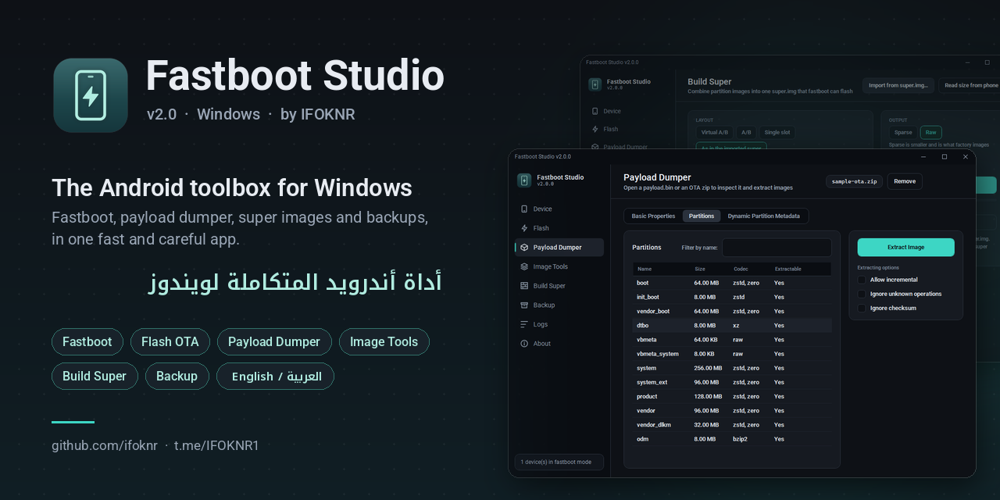
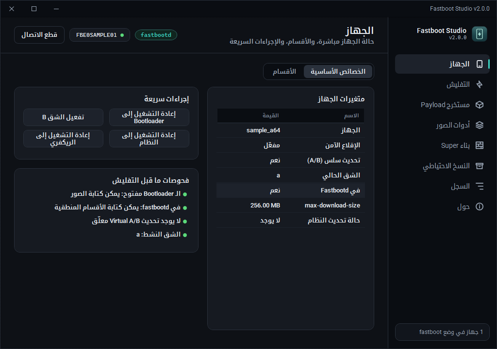
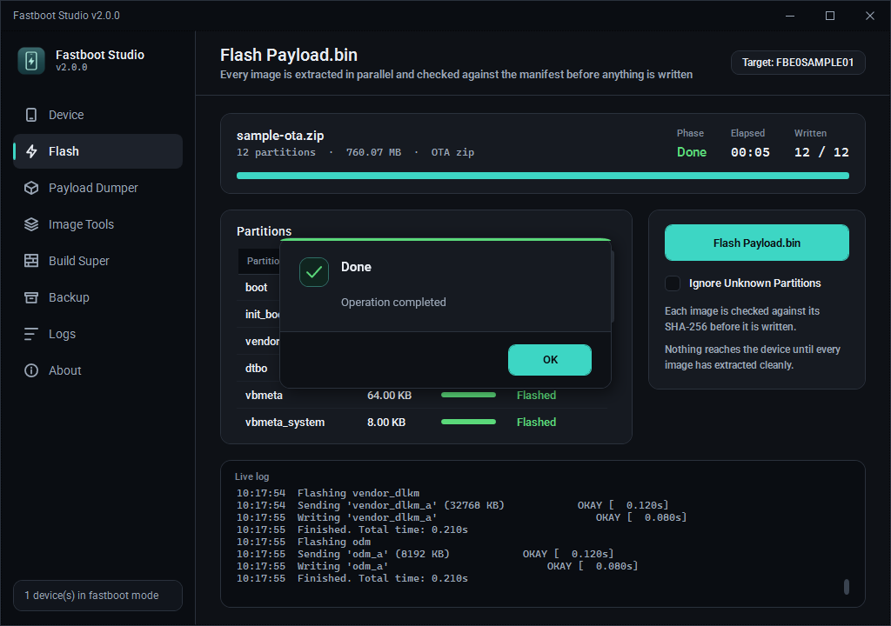
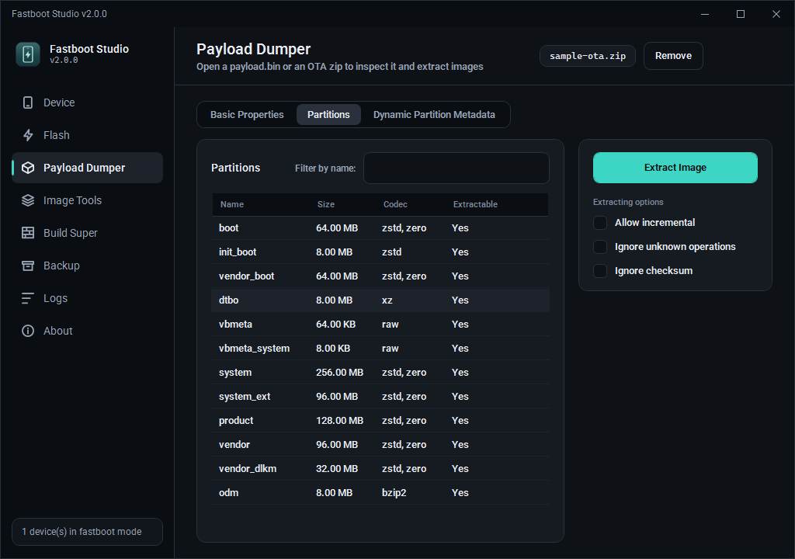
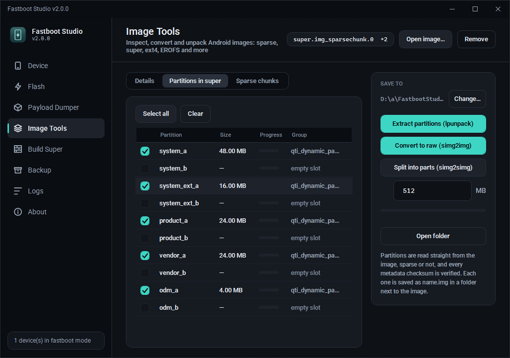
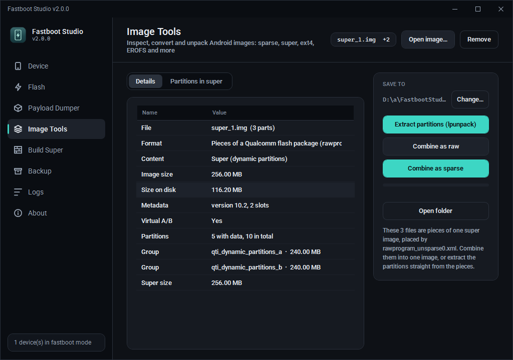
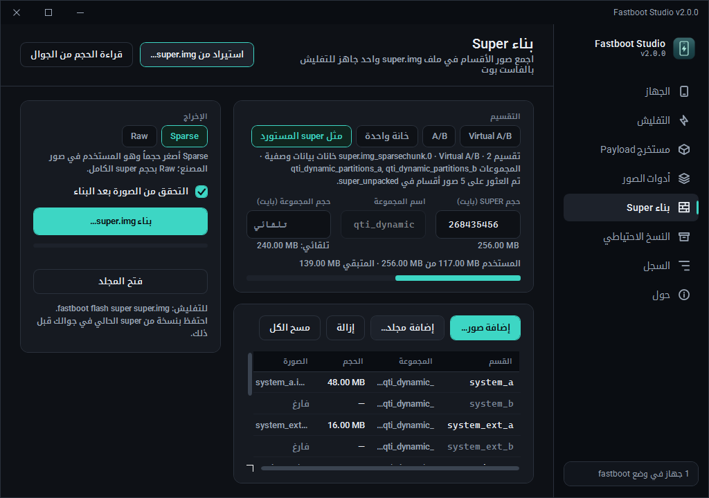
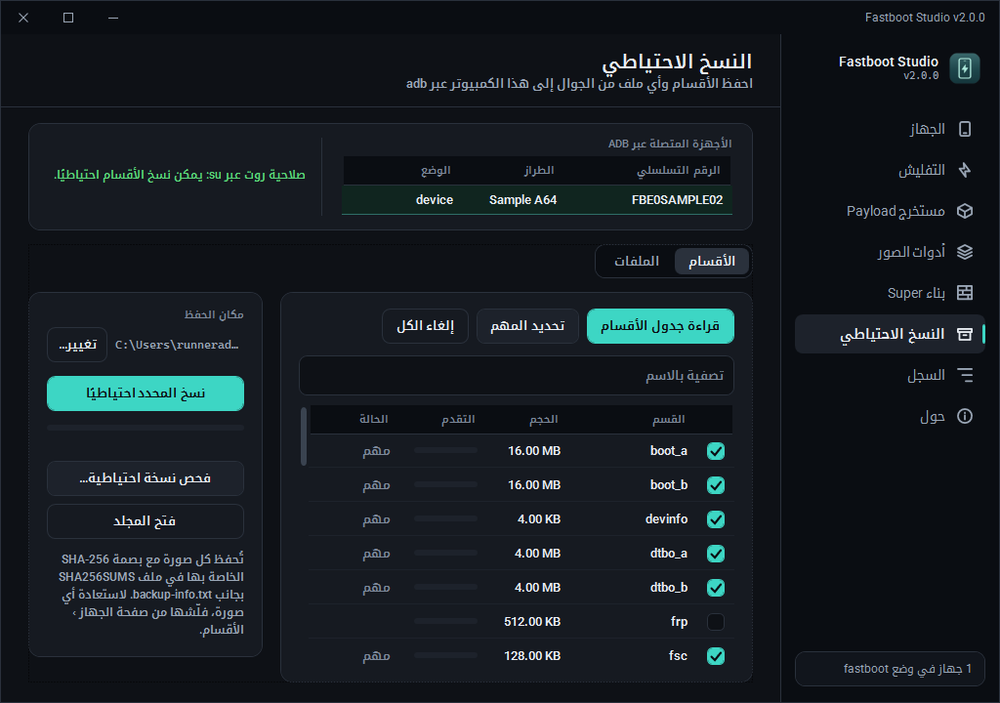
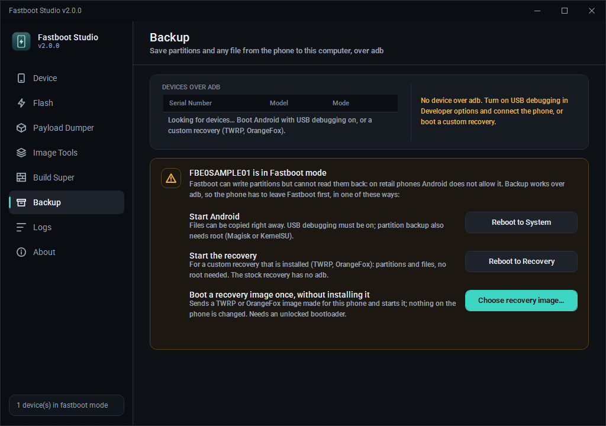

  

  <b>فاست بوت، تفليش التحديثات، مستخرج Payload، صور super والنسخ الاحتياطي — في برنامج واحد لويندوز.</b> 
  <a href="README.md">English</a> · <a href="#تحميل">التحميل</a> · <a href="#الأقسام">أقسام البرنامج</a> · <a href="#شرح">طريقة الاستخدام</a> · <a href="CHANGELOG.md">سجل التعديلات</a> · <a href="#ساهم">ساهم معنا</a>

**Fastboot Studio** نسخة مطوّرة بالكامل من برنامج [Fastboot Enhance](https://github.com/libxzr/FastbootEnhance)
للمطوّر LibXZR. يحتفظ بكل ما كان يقدّمه الأصلي، ويضيف ما يحتاجه كل من يتعامل مع تفليش الجوالات يومياً:

- تفليش آمن لملفات التحديث.
- أدوات صور تغني عن `simg2img` و `lpunpack` و `lpmake`.
- أداة لبناء ملف super.
- نسخ احتياطي للأقسام والملفات عبر adb.

كل هذا يعمل داخل البرنامج نفسه، بدون بايثون ولا أدوات لينكس ولا تثبيت أي شيء.

> 🆕 **نسخة جديدة.** Fastboot Studio هو الإصدار الجديد من Fastboot Enhance: واجهة جديدة بالكامل، وصفحات جديدة، وحماية أكثر للجوال.
>
> **الجديد في 2.3:**
> - وضع فاتح وداكن (أو مثل ويندوز).
> - صفحة **الطرفية** لأوامر adb و fastboot الخاصة فيك، بنفس أسئلة الحماية.
>
> **الجديد في 2.2:**
> - بطاقة مساحة super، وتأكد إن الصور تدخل قبل التفليش.
> - إنشاء الأقسام الناقصة اللي يحتاجها التحديث.
> - زر **فحص USB** يكشف التعريف الناقص ووضع EDL و BROM.
>
> **الجديد في 2.1:**
> - حماية تبديل الخانة: يحذّر أو يمنع إذا الخانة الثانية فاضية أو ما تقلع.
> - الأقسام الحساسة (xbl و abl و modem و persist و preloader…) ما تتفلش إلا بعد كتابة اسم القسم.
> - زر «إقلاع مرة واحدة» يرفض init_boot و vendor_boot.
>
> كل التفاصيل في [سجل التعديلات](CHANGELOG.md).
>
> 🤝 **تبي تساعد؟ تفضّل.** المشروع مفتوح للجميع، وأي مساعدة مرحّب فيها: تجربة على جوالك، بلاغ عن مشكلة، فكرة، ترجمة، أو كود. شوف [ساهم معنا](#ساهم).

---

## التحميل والتشغيل

1. حمّل آخر نسخة من **[صفحة الإصدارات](https://github.com/ifoknr/FastbootStudio/releases)**، أو من ملف
   `FastbootStudio-win-x64` في آخر [عملية بناء](https://github.com/ifoknr/FastbootStudio/actions/workflows/build.yml).
2. فك الضغط في أي مكان.
3. شغّل `FastbootStudio.exe`.

**لا يحتاج تثبيت أي شيء:** ‎.NET و adb و fastboot (platform-tools 37.0.1) كلها مدمجة.
فقط تأكد أن تعريف USB الخاص بجوالك مثبت في ويندوز، مثل [Google USB Driver](https://developer.android.com/studio/run/win-usb).

**فتح ملف مباشرة:** اسحب ملف التحديث أو الصورة وأفلته على البرنامج، أو شغّل `FastbootStudio.exe ota.zip`.

---

## أقسام البرنامج بالتفصيل

### 📱 الجهاز

كل ما يقدر الفاست بوت يعرضه أو يسويه، على الجوال الموصّل.

- **الأجهزة:** يعرض كل جوال في وضع **bootloader** أو **fastbootd**. اضغط عليه مرتين لفتحه.
- **فحص USB:** إذا الجوال موصّل وما ظهر، الزر يشوف وش يشوف ويندوز ويقول لك السبب:
  - تعريف ناقص أو خربان، مع خطوات تثبيته.
  - وضع ما يوصله الفاست بوت: EDL حق كوالكوم (9008)، BROM أو Preloader حق ميدياتك، وضع التحميل حق Unisoc أو سامسونج.
  - الجوال للحين في أندرويد، ويعرض عليك إعادة تشغيله للبوت لودر.
- **الخصائص الأساسية:** كل قيم `getvar`، مثل:
  - الطراز وعدد الخانات.
  - حالة قفل البوت لودر والخانة الحالية.
  - حالة تحديث Virtual A/B.
- **الأقسام:** كل قسم بحجمه، وهل هو منطقي (داخل super) أم لا، مع بحث بالاسم.
- **مساحة super** (في fastbootd): كم ماخذ كل سلوت ونسخ التحديث (COW)، وكم الفاضي تقريباً. وقبل التفليش على قسم منطقي يتأكد إن الصورة تدخل، وإذا ما دخلت يقول لك كم ناقص ووش تقدر تحذف عشان توفر مساحة.
- **عمليات الأقسام:**
  - **تفليش** صورة على القسم.
  - **مسح** القسم.
  - للأقسام المنطقية فقط: **إنشاء** و**تغيير الحجم** و**حذف**.
  - العمليات الخطرة تطلب تأكيداً باللون الأحمر.
  - **فحص صورة الإقلاع** قبل تفليش boot أو init_boot أو recovery أو vendor_boot: يفك ضغط الصورة (gzip و lz4 و zstd و xz) ويقرأ إصدار الكيرنل والـ KMI ومستوى الحماية والروت (Magisk و KernelSU و APatch و SuSFS). يمنع الأغلاط المعروفة: صورة init_boot في boot (ما فيها كيرنل)، صورة boot في vendor_boot، أو ملف مو صورة إقلاع أصلاً. وإذا فتحت جوالك مرة في صفحة النسخ الاحتياطي، يعرف كيرنل جوالك ومستوى حمايته، وينبهك قبل ما تفلش كيرنل مبني لـ KMI ثاني (يعلّق الجوال) أو صورة أقدم من جوالك.
  - **الأقسام الحساسة** (xbl و abl و tz و modem و persist و frp و preloader و nvdata…) ما تتفلش ولا تنمسح إلا بعد ما تكتب اسم القسم بيدك، لأن الغلط فيها ممكن يطفي الجوال نهائياً أو يضيّع الـ IMEI.
  - عند تفليش **vbmeta** يسألك عن تعطيل التحقق، ويوضح إنه يحتاج بوت لودر مفتوح وغالباً فورمات.
- **فحوصات ما قبل التفليش:**
  - هل البوت لودر مفتوح أو مقفل.
  - هل الجوال في bootloader أو fastbootd.
  - هل يوجد تحديث معلّق أو أقسام COW متبقية.
  - ما هي الخانة الحالية.
- **إعادة التشغيل:** إلى النظام أو Bootloader أو Fastbootd أو الريكفري.
- **الخانات والتحديثات:** **تبديل الخانة** A ↔ B، و**إلغاء التحديث المعلّق** الذي يمنع التفليش.
- **حماية تبديل الخانة:** قبل التبديل يقرأ حالة الخانة الثانية:
  - 🟡 ما قلعت بعد (طبيعي بعد التحديث): تحذير بسيط.
  - 🔴 معلّمة إنها ما تقلع أو خلصت محاولاتها: تأكيد باللون الأحمر.
  - ⛔ في fastbootd، إذا أقسامها المنطقية فاضية أو ناقصة (مثل بعد تفليش super من المصنع): يرفض التبديل ويذكر الأقسام.
  - إذا البوت لودر ما يعطي معلومات (كثير من أجهزة ميدياتك) ما يمنع.
- **إقلاع مرة واحدة:** يشغّل صورة boot أو ريكفري من الذاكرة بدون تفليش (`fastboot boot`). يقرأ رأس الصورة ويرفض init_boot و vendor_boot لأنها ما تقلع لحالها، وإذا الجوال في fastbootd يعرض عليك الانتقال للبوت لودر أولاً.

**الفائدة:** بدون أوامر ولا أخطاء كتابة في أسماء الأقسام، وتشوف كل معلومات الجوال قبل ما تلمس أي شيء.

### ⚡ التفليش

يفلّش ملف تحديث كامل (`payload.bin` أو ملف OTA zip) على الجوال في وضع fastbootd.

- **يستخرج كل الصور أولاً، بالتوازي، ويتحقق من بصمة SHA-256 لكل صورة** قبل كتابة أي شيء.
  الملف التالف لا يصل للجوال أبداً.
- **الأقسام الناقصة:** إذا التحديث فيه أقسام منطقية مو موجودة في الجوال، ينشئها داخل super أولاً (مع توضيح مجموعة `default` في fastbootd)، ويتأكد إن الصور تدخل في super قبل الكتابة.
- تقدّم كل قسم، والمرحلة، والوقت، وسجل fastboot مباشر.
- يسألك قبل إغلاق البرنامج أثناء التفليش، حتى لا يبقى الجوال نصف مفلّش.

**الفائدة:** تفليش روم رسمي بضغطة واحدة، مع كل فحوصات الأمان.

### 📦 مستخرج Payload

يفتح `payload.bin` أو ملف التحديث zip كاملاً، ويقرأه من مكانه بدون فك ضغطه على القرص.

- **الخصائص:**
  - الإصدار وحجم البيانات والتواقيع.
  - هل التحديث كامل أو تزايدي.
  - التاريخ وحجم الكتلة وتاريخ الحماية الأمنية.
- **الأقسام:** حجم كل صورة ونوع ضغطها. استخرج الكل أو اختر ما تريد فقط.
- **بيانات الأقسام الديناميكية:** المجموعات وأحجامها.
- **الضغط:** يدعم كل أنواع ضغط تحديثات A/B (raw و bzip2 و xz و zstd و zero و discard).
- **السرعة والتحقق:** يفك بالتوازي ويتحقق بـ SHA-256.

**الفائدة:** استخرج `boot.img` أو `init_boot.img` أو `vendor_boot.img` من التحديث في ثوانٍ، لترقيعه بـ Magisk أو KernelSU.

### 🧱 أدوات الصور

نسخة مدمجة من أدوات أندرويد الرسمية (libsparse و liblp)، تعمل داخل البرنامج.

- **فحص أي صورة:**
  - الأنواع: sparse أو raw، super، ext4، EROFS، F2FS، boot، vendor_boot، vbmeta، DTBO.
  - يعرض الحجم وعدد الكتل والبصمات.
  - لصور boot و init_boot: إصدار الكيرنل والـ KMI، ونسخة أندرويد، ومستوى الحماية، ونوع الضغط، وهل هي مروّتة بـ Magisk أو KernelSU أو APatch.
- **من sparse إلى raw** (`simg2img`):
  - يشمل الصور المقسّمة `*_sparsechunk.N`.
  - مع فحص CRC-32.
- **من raw إلى sparse** (`img2simg`) **والتقسيم إلى أجزاء** (`simg2simg`)، والنتيجة مطابقة لأدوات أندرويد بايت ببايت.
- **فك super** (`lpunpack`):
  - مباشرة من صورة sparse أو مقسّمة أو raw.
  - مع التحقق من كل بصمات البيانات الوصفية.
- **حزم تفليش كوالكوم:**
  - القسم المقسّم إلى أجزاء (`super_1.img`، `super_2.img`…) حسب ملف `rawprogram*.xml` يُفتح كصورة واحدة.
  - تقدر تفكه مباشرة، أو تجمع الأجزاء في `super.img` واحد بصيغة raw أو sparse.

**الفائدة:** بدون WSL ولا سكربتات بايثون ولا البحث عن نسخة `simg2img` الصحيحة.

### 🧩 بناء Super

يجمع صور الأقسام في ملف `super.img` من جديد (مثل `lpmake`)، بصيغة raw أو sparse.

- **أنواع التقسيم كما يبنيها أندرويد:**
  - **Virtual A/B**: أغلب الجوالات من أندرويد 11.
  - **A/B**.
  - **خانة واحدة**.
  - أو **استيراد تقسيم ملف super موجود** بنفس المجموعات والخانات وترتيب الأقسام.
- **قراءة الحجم من الجوال:** يسأل الجوال في وضع الفاست بوت عن حجم super ونوع التقسيم.
- **العثور على الصور تلقائياً:** الصور اللي فككتها بأدوات الصور يلقاها لحاله، فتصير خطوات *فك ← تعديل ← إعادة بناء* بضغطات قليلة.
- **قبل البناء:** شريط يوضح المساحة المستخدمة، وتحذيرات واضحة لو super أو المجموعة أصغر من اللازم.
- **بعد البناء:**
  - **يُقرأ الملف من جديد ويُقارن كل قسم بصورته** قبل ما يقول إنه جاهز.
  - ملف raw الناتج **مطابق بايت ببايت** لما تنتجه أداة أندرويد الرسمية (liblp).

**الفائدة:** تعدّل صورة system أو vendor أو product وتبني super جاهز للتفليش بدون لينكس.

### 💾 النسخ الاحتياطي

ينسخ من الجوال إلى الكمبيوتر عبر adb، من نظام أندرويد (مع تصحيح USB) أو من ريكفري مخصص.

- **الأقسام:**
  - يقرأ جدول الأقسام وينسخ اللي تختاره.
  - **«تحديد المهم»** يختار لك الأقسام الحساسة: boot و vbmeta و persist، وبيانات المودم والـ IMEI (`modemst1/2` و `fsg`)، و `devinfo` وغيرها.
  - يحتاج روت (Magisk أو KernelSU) أو ريكفري مخصص (TWRP أو OrangeFox).
- **التحقق:**
  - كل صورة تُسجَّل ببصمة **SHA-256** في ملف `SHA256SUMS`، مع ملف `backup-info.txt` فيه معلومات الجوال.
  - **«فحص نسخة احتياطية…»** يتحقق من النسخة لاحقاً.
- **الملفات:** تتصفح ذاكرة الجوال (مع اختصارات DCIM و Download و Documents و Pictures)، و**«نسخ إلى الكمبيوتر»** لأي ملف أو مجلد، **بدون روت**.
- **الجوال في وضع الفاست بوت؟** البرنامج يتعرّف عليه، ويشرح ليش ما ينفع النسخ من هذا الوضع، ويخرجك منه:
  - إعادة التشغيل إلى أندرويد.
  - إعادة التشغيل إلى الريكفري.
  - **تشغيل صورة TWRP أو OrangeFox مؤقتاً** بدون تفليشها.

**الفائدة:** تحفظ الأقسام اللي ما تقدر تحمّلها من أي مكان (IMEI والمعايرة و persist) قبل فتح البوت لودر أو الروت أو التفليش.

### 🖥️ الطرفية

اكتب أوامر adb و fastboot ونفّذها بالأدوات المدمجة في البرنامج.

- أوامر جاهزة تبدأ منها، وسجل أوامر بالأسهم فوق وتحت، وزر إيقاف لأي أمر يستمر مثل logcat.
- مجلد عمل للملفات المكتوبة بدون مسار: `cd FOLDER` أو زر «المجلد»، أو اسحب الملف على السطر عشان يضيف مساره كامل.
- نفس حماية باقي البرنامج: تفليش أو مسح قسم حساس، و `flashing lock`، و `dd` على قسم، كلها تحتاج تكتب كلمة قبل التنفيذ، والأوامر اللي تمسح البيانات تسألك أول.

### 📝 السجل و ℹ️ حول

- **السجل:** كل أمر ينفذه البرنامج وكل رد من fastboot و adb، مع نسخ ومسح.
- **حول:**
  - الإصدار والحقوق والرخصة.
  - **تبديل اللغة:** العربية بواجهة كاملة من اليمين لليسار، الإنجليزية، الصينية، اليابانية، الكورية.
  - **المظهر:** داكن أو فاتح أو مثل ويندوز.

---

## طريقة الاستخدام خطوة بخطوة

### نسخة احتياطية للأقسام قبل الروت أو التفليش

1. **جهّز الجوال**، بإحدى طريقتين:
   - شغّله على أندرويد مع تفعيل **تصحيح USB** من خيارات المطوّر، ووافق على السماح لهذا الكمبيوتر. إذا كان عندك روت، وافق على طلب Magisk أو KernelSU لما يظهر.
   - أو شغّله على ريكفري مخصص (TWRP أو OrangeFox).
2. افتح **النسخ الاحتياطي ← الأقسام** واضغط **«قراءة جدول الأقسام»**.
3. الأقسام المهمة محددة تلقائياً، وتقدر تضيف غيرها.
4. اضغط **«نسخ المحدد احتياطيًا»**. النسخة تُحفظ في
   `Documents\Fastboot Studio\Backups\<الطراز>_<الرقم التسلسلي>_<التاريخ>`.
5. احتفظ بالمجلد كاملاً، و**«فحص نسخة احتياطية…»** يتحقق من كل البصمات لاحقاً.

> إذا كان الجوال في وضع الفاست بوت، الصفحة تعرض عليك إعادة تشغيله أو تشغيل ريكفري مؤقت.

### نسخ ملفات وصور من الجوال

1. شغّل الجوال على أندرويد مع تصحيح USB. لا يحتاج روت.
2. **النسخ الاحتياطي ← الملفات**: تنقّل بين المجلدات، أو استخدم الاختصارات.
3. اختر الملفات أو المجلدات (Ctrl+A للكل) واضغط **«نسخ إلى الكمبيوتر»**.

### استخراج boot.img من تحديث (لـ Magisk أو KernelSU)

1. **مستخرج Payload** ← افتح ملف التحديث zip أو `payload.bin`.
2. من تبويب الأقسام اختر `boot`، أو `init_boot` للجوالات اللي صدرت بأندرويد 13 وما بعده، ثم **«استخراج الصور»**.

### فك super وتعديله وإعادة بنائه

1. **أدوات الصور** ← افتح `super.img`، سواء كان sparse أو مقسّماً أو raw أو `super_1.img` من حزمة كوالكوم.
2. **«استخراج الأقسام»** ← تُحفظ في مجلد `super_unpacked`.
3. عدّل الصور اللي تبيها.
4. **بناء Super** ← **«استيراد من super.img…»** ← اختر نفس ملف super. ينسخ التقسيم ويلقى الصور المفكوكة تلقائياً.
5. اختر **Sparse**، ثم **«بناء super.img…»**، ويتم التحقق منه بعد البناء.
6. فلّشه بـ `fastboot flash super super.img`.

> احتفظ بنسخة من super الحالي في جوالك قبل التفليش.

### جمع super_1.img … super_N.img من حزمة كوالكوم

1. خلّ الأجزاء بجانب ملف `rawprogram*.xml` الخاص بالحزمة.
2. افتح `super_1.img` في **أدوات الصور**.
3. اختر **«جمعها كـ sparse»** للتفليش بالفاست بوت، أو **«جمعها كـ raw»**.

---

## 🤝 ساهم معنا

البرنامج مجاني ومفتوح المصدر، ويتطوّر بمساعدة اللي يستخدمونه. إذا حاب تساعد، تفضّل، وكل مساهمة لها قيمة حتى لو صغيرة:

- **جرّبه على جوالك** وقل لنا وش اشتغل ووش ما اشتغل، خصوصاً أجهزة ميدياتك وكوالكوم و Unisoc المختلفة.
- **بلّغ عن مشكلة** من [Issues](https://github.com/ifoknr/FastbootStudio/issues/new/choose)، مع موديل الجوال والوضع (bootloader أو fastbootd) ونسخة من صفحة «السجل».
- **اقترح فكرة** لميزة جديدة أو تحسين.
- **حسّن الترجمة** العربية أو الإنجليزية أو أضف لغة جديدة.
- **ساهم بالكود:** سوِّ Fork وافتح Pull Request. التفاصيل في [CONTRIBUTING.md](CONTRIBUTING.md).
- **انشر البرنامج** لمن يحتاجه، وحط ⭐ للمستودع.

للتواصل المباشر: تيليجرام [@IFOKNR1](https://t.me/IFOKNR1).

---

## الحقوق

- التطوير والصيانة: **IFOKNR**، تيليجرام [@IFOKNR1](https://t.me/IFOKNR1) وقيت هب [ifoknr](https://github.com/ifoknr).
- مبني على [Fastboot Enhance](https://github.com/libxzr/FastbootEnhance) للمطوّر **LibXZR**، برخصة MIT (Copyright (c) 2021 LibXZR).
- أكواد صور sparse منقولة من AOSP libsparse ([android-simg2img](https://github.com/ifoknr/android-simg2img)، رخصة Apache 2.0)، وصيغة super من AOSP liblp.
- [Android Platform Tools](https://developer.android.com/studio/releases/platform-tools) 37.0.1 (رخصة Apache 2.0).
- الخطوط: [Roboto](https://fonts.google.com/specimen/Roboto) و [Noto Kufi Arabic](https://fonts.google.com/noto/specimen/Noto+Kufi+Arabic) (رخصة SIL OFL 1.1).

البرنامج منشور برخصة [MIT](LICENSE).

