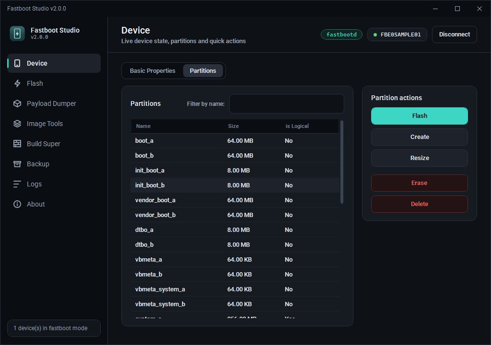
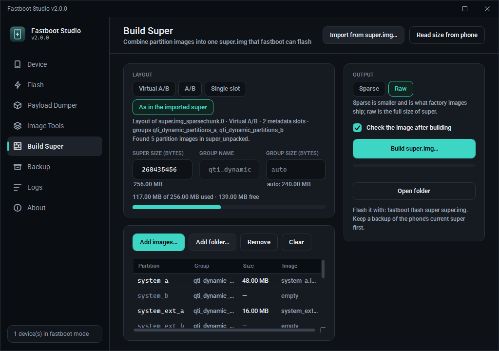
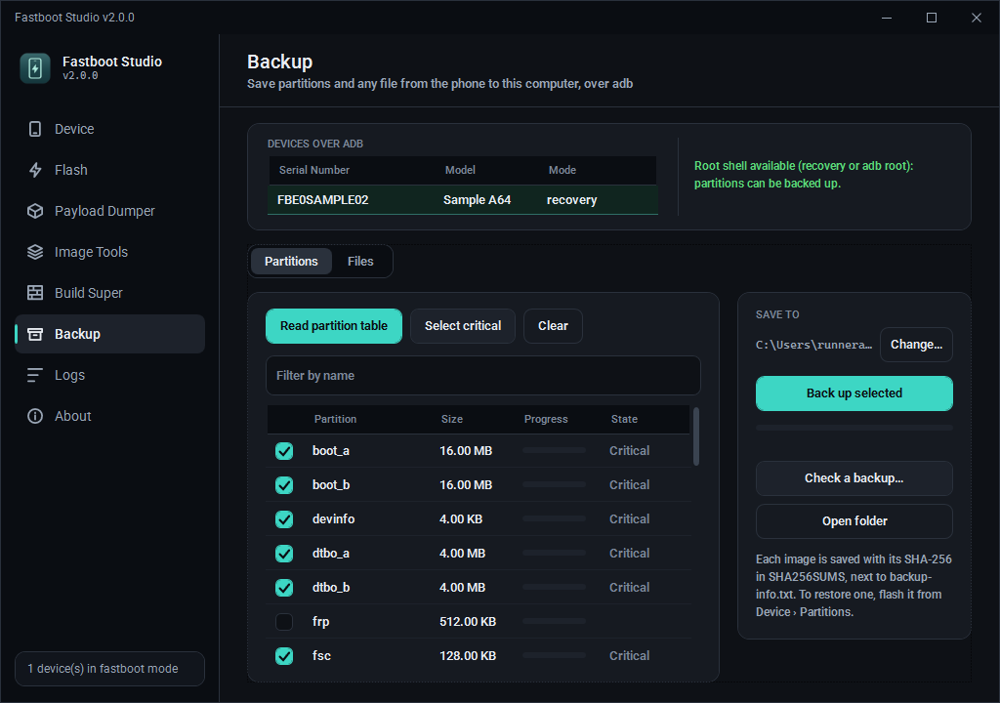

<p align="center">
  
</p>

<p align="center">
  <b>Fastboot, OTA flashing, payload dumper, super images and backups — in one Windows app.</b><br>
  <a href="README.ar.md">العربية</a> · <a href="#download">Download</a> · <a href="#pages">Pages</a> · <a href="CHANGELOG.md">What's new</a> · <a href="#contributing">Contributing</a>
</p>

<p align="center">
  
  
  
  <a href="https://github.com/ifoknr/FastbootStudio/releases/latest"></a>
  
</p>

Fastboot Studio is a modern rewrite of [Fastboot Enhance](https://github.com/libxzr/FastbootEnhance)
by LibXZR. It keeps everything the original did and adds what people who flash phones
reach for every day: a safe OTA flasher, image tools that replace `simg2img` / `lpunpack`
/ `lpmake`, a super image builder, and backups of partitions and files over adb.
Everything runs inside the app, in managed code, with no Python, no Linux tools and
nothing to install.

> 🆕 **A new version.** Fastboot Studio is the new generation of Fastboot Enhance: a new
> interface from top to bottom, new pages, and more protection for the phone.
>
> **New in 2.3:**
> - Light and dark appearance (or as Windows).
> - A **Terminal** page for your own adb and fastboot commands, with the same safety questions.
>
> **New in 2.2:**
> - A Super space card, and a check that images fit in super before flashing.
> - Partitions an update needs but the phone lacks are created for you.
> - A **USB check** that finds missing drivers and EDL / BROM modes.
>
> **New in 2.1:**
> - Slot switch protection: warns about, or refuses, a slot that is empty or will not boot.
> - Critical partitions (xbl, abl, modem, persist, preloader…) are written only after you type their name.
> - A **Boot once** button that refuses init_boot and vendor_boot.
>
> Everything is in the [changelog](CHANGELOG.md).
>
> 🤝 **Want to help? You are welcome.** The project is open to everyone: testing on your
> phone, bug reports, ideas, translations or code. See [Contributing](#contributing).

---

<a id="download"></a>
## Download

1. Download the latest build: **[Releases](https://github.com/ifoknr/FastbootStudio/releases)**
   (or the `FastbootStudio-win-x64` artifact of the newest
   [build run](https://github.com/ifoknr/FastbootStudio/actions/workflows/build.yml)).
2. Unzip it anywhere.
3. Run `FastbootStudio.exe`.

The build is self-contained: .NET, `adb` and `fastboot` (platform-tools 37.0.1) are
included. You only need the phone's USB driver installed in Windows
(e.g. the [Google USB Driver](https://developer.android.com/studio/run/win-usb)).

An OTA or image can be opened straight away: `FastbootStudio.exe ota.zip`, or drop the
file onto the exe.

---

<a id="pages"></a>
## The pages, one by one

### 📱 Device



Everything fastboot can tell and do, on the phone that is connected.

- Lists every phone in **bootloader** or **fastbootd**; double-click to open one.
- **USB check**: when a phone is plugged in but not listed, it reads what Windows sees and
  says why: a missing or broken driver (with the steps to install it), or a mode fastboot
  cannot reach (Qualcomm EDL 9008, MediaTek BROM/preloader, Unisoc or Samsung download), or a
  phone still in Android, which it can reboot to the bootloader.
- **Basic properties**: all `getvar` values (product, slots, unlock state, current slot,
  snapshot status…).
- **Partitions**: every partition with its size and whether it is logical (inside super),
  with a filter by name.
- **Super space** (fastbootd): what each slot and the update copies (COW) take in super and
  about how much is free. Before writing to a logical partition, the app checks the image
  fits; when it does not, it says by how much and what could make room.
- Partition actions: **flash** an image, **erase**, and for logical partitions
  **create**, **resize** and **delete**. Destructive actions ask first, in red.
- **Critical partitions** (xbl, abl, tz, modem, persist, frp, preloader, nvdata…) are flashed
  or erased only after you type the partition name: a mistake there can hard-brick the phone
  or lose its IMEI. Flashing **vbmeta** offers to disable verification and says what that needs.
- **Pre-flash checks** at a glance: bootloader unlocked or locked, bootloader or fastbootd,
  a pending Virtual A/B update, leftover COW partitions, current slot.
- **Reboot** to system, bootloader, fastbootd or recovery, **switch slot** A ↔ B, and
  **cancel a pending update** that blocks flashing.
- **Slot switch protection**: before switching, the other slot's state is read. Not booted yet
  (normal after an update) warns; marked unbootable or out of retries asks in red; in fastbootd,
  empty or missing logical partitions on that slot (as after a factory super) refuse the switch
  and name them. A bootloader that reports nothing does not block.
- **Boot once** starts a boot or recovery image from memory (`fastboot boot`) without flashing
  it. The image header is checked first: init_boot and vendor_boot cannot start on their own
  and are refused, and from fastbootd it offers the bootloader first.

**Why it helps:** no command line, no typos in partition names, and you see what the
phone reports before you touch anything.

<br clear="right">

### ⚡ Flash


Flashes a full OTA (`payload.bin` or the OTA zip) to the phone in fastbootd.

- **Every image is extracted first, in parallel, and checked against its SHA-256**
  before anything is written. A broken download never reaches the phone.
- **Missing partitions** the OTA places in super are created first (with a note on
  fastbootd's `default` group), and the images are checked to fit in super before writing.
- Per-partition progress, phase, elapsed time and a live fastboot log.
- Asks before closing the app mid-flash, since that would leave the phone half written.

**Why it helps:** flash a stock OTA in one click, with the safety checks done for you.

<br clear="right">

### 📦 Payload Dumper


Opens `payload.bin` or a whole OTA zip (read in place, never unzipped to disk).

- **Basic properties**: format version, data size, signatures, full or incremental,
  timestamp, block size, security patch, and whether the zip is read in place.
- **Partitions**: size and compression of every image; extract all or only the ones you pick.
- **Dynamic partition metadata**: groups and sizes from the manifest.
- Every compression an A/B OTA can use: raw, bzip2, xz, zstd, zero, discard
  ([details](#payload-formats)). Decoded in parallel and checked with SHA-256.

**Why it helps:** get `boot.img`, `init_boot.img` or `vendor_boot.img` (for Magisk or
KernelSU) out of an OTA in seconds.

<br clear="right">

### 🧱 Image Tools


A native port of AOSP's libsparse and liblp: the Linux image tools, inside the app.

- **Inspect** any image: sparse or raw, super, ext4, EROFS, F2FS, boot, vendor_boot,
  vbmeta, DTBO — with size, block counts and checksums.
- **Sparse → raw** (`simg2img`), including split `*_sparsechunk.N` parts, with CRC-32 checks.
- **Raw → sparse** (`img2simg`) and **split into parts** (`simg2simg`),
  byte-identical to the AOSP tools.
- **Unpack super** (`lpunpack`) straight from a sparse, split or raw super; every
  metadata checksum verified.
- **Qualcomm flash packages**: a partition shipped as pieces (`super_1.img`,
  `super_2.img`, … placed by `rawprogram*.xml`) opens as one image. Unpack it directly
  or combine the pieces into one raw or sparse `super.img`.

**Why it helps:** no WSL, no Python scripts, no hunting for the right `simg2img` build.

<br clear="right">

### 🧩 Build Super



Puts partition images back together into a `super.img` (`lpmake`), raw or sparse.

- Layouts as the AOSP build makes them: **Virtual A/B**, **A/B**, or **single slot**,
  or **import the exact layout of an existing super** (groups, slots, partition order).
- **Read size from phone**: asks the phone in fastboot for the size of super and its
  slot layout.
- Images unpacked by Image Tools are **found by themselves**, so
  *unpack → modify → rebuild* is a few clicks.
- A usage bar and clear warnings before building (super or a group too small,
  bad names…).
- **Every build is read back and each partition compared with its image** before the
  page calls it done. The raw output is **byte-identical to AOSP liblp's**.

**Why it helps:** modify a system, vendor or product image and rebuild a flashable super
without a Linux machine.

<br clear="right">

### 💾 Backup



Backs up the phone over adb, from Android (USB debugging) or a custom recovery.

- **Partitions**: reads the partition table and backs up the ones you choose.
  The important ones (boot, vbmeta, persist, modem/IMEI data, `modemst1/2`, `fsg`,
  `devinfo`…) are ticked for you (**Select critical**). Needs root (Magisk / KernelSU) or a custom recovery
  (TWRP, OrangeFox).
- Each image is recorded with its **SHA-256** in `SHA256SUMS`, with a `backup-info.txt`
  describing the phone. **Check a backup…** verifies one again later.
- **Files**: browse the phone's storage (quick links to DCIM, Download, Documents, Pictures)
  and **Copy to computer** any file or folder. No root needed.
- **Phone in fastboot?** The page recognises it, explains why a backup cannot be taken
  there, and gets it out: reboot to Android or recovery, or **boot a TWRP / OrangeFox
  image once** without flashing it.

**Why it helps:** keep the partitions you cannot download anywhere (IMEI, calibration,
persist) before you unlock, root or flash.

<br clear="right">

### 🖥️ Terminal

Type adb and fastboot commands and run them with the tools that come with the app.

- Quick commands to start from, history with Up/Down, and Stop for anything that keeps
  running (logcat).
- A working folder for files named without a path: `cd FOLDER`, the Folder button, or drop a
  file on the line to add its full path.
- The same protection as the rest of the app: flashing or erasing a critical partition,
  `flashing lock` and `dd` to a partition need a typed word; commands that wipe data ask first.

### 📝 Logs and ℹ️ About

- **Logs**: everything the app runs and every fastboot / adb answer, to copy or clear.
- **About**: version, credits, license, the **language switch** and the **appearance** (dark, light, or as Windows)
  (English, العربية with a full right-to-left layout, 中文, 日本語, 한국어).

---

## How to…

<details>
<summary><b>Back up partitions before rooting or flashing</b></summary>

1. Boot the phone to Android with **USB debugging** on (Developer options), and allow this
   computer on the phone. With root, accept the Magisk / KernelSU prompt when it appears.
   — or boot a custom recovery (TWRP / OrangeFox).
2. Open **Backup → Partitions** and press **Read partition table**.
3. The important partitions are already ticked; add any others you want.
4. Press **Back up selected**. The images go to `Documents\Fastboot Studio\Backups\<model>_<serial>_<date>`.
5. Keep the whole folder. **Check a backup…** re-checks every SHA-256 later.

If the phone is in fastboot, the page offers to reboot it or to boot a recovery image once.
</details>

<details>
<summary><b>Get boot.img out of an OTA (for Magisk / KernelSU)</b></summary>

1. **Payload Dumper** → open the OTA zip or `payload.bin`.
2. Partitions tab → select `boot` (or `init_boot` on phones that launched with Android 13+) → **Extract Image**.
</details>

<details>
<summary><b>Unpack, modify and rebuild super</b></summary>

1. **Image Tools** → open `super.img` (sparse, split, raw, or Qualcomm `super_1.img`).
2. **Extract partitions** → they are written to `super_unpacked`.
3. Modify the images you need.
4. **Build Super** → **Import from super.img** → pick the same super. The layout is copied
   and the unpacked images are attached by themselves.
5. **Build super.img…** (sparse for fastboot) → it is checked after building.
6. Flash with `fastboot flash super super.img`. Keep a backup of the phone's current super first.
</details>

<details>
<summary><b>Combine super_1.img … super_N.img from a Qualcomm package</b></summary>

Keep the pieces next to the package's `rawprogram*.xml`, open `super_1.img` in
**Image Tools**, then **Combine as sparse** (for fastboot) or **Combine as raw**.
</details>

---

<a id="payload-formats"></a>
## Supported payload formats

Every compression an A/B OTA can use is handled in managed code, with no native
decompression libraries:

| Operation | Type | Status |
| --- | --- | --- |
| `REPLACE` | 0 | supported (raw) |
| `REPLACE_BZ` | 1 | supported (bzip2) |
| `REPLACE_XZ` | 8 | supported (xz) |
| `ZSTD` | 14 | supported (zstd) |
| `ZERO` | 6 | supported |
| `DISCARD` | 7 | supported |
| `SOURCE_COPY`, `MOVE` | 4, 2 | reported as needing the previous image |
| `BSDIFF`, `SOURCE_BSDIFF`, `BROTLI_BSDIFF`, `PUFFDIFF`, `ZUCCHINI`, `LZ4DIFF_*` | 3, 5, 10, 9, 11, 12, 13 | reported as unsupported, with the reason |

- An operation may write to **several destination extents**; they are applied in
  manifest order, as AOSP's `DirectExtentWriter` does.
- A `payload.bin` **stored** in an OTA zip is read in place, so a multi-gigabyte package is
  never unpacked to disk. ZIP64 is handled.
- SHA-256 is checked per operation and again over the finished image.
- Incremental OTAs are reported clearly per partition; an image whose checksum passes can
  still be extracted.

---

## For developers

| Path | What it is |
| --- | --- |
| `./` | the WPF app (`net8.0-windows`) |
| `src/FastbootEnhance.Core` | payload, sparse, super and adb logic, no UI (`netstandard2.0` + `net8.0`) |
| `tests/FastbootEnhance.Core.Tests` | xunit suite (194 tests), including byte-for-byte checks against AOSP liblp |
| `tools/FastbootEnhance.PayloadTool` | command line front end for the core |
| `tools/FastbootEnhance.SampleGen` | builds the sample OTA, super and Qualcomm pieces used by CI |
| `tools/FastbootEnhance.FakeFastboot`, `FakeAdb` | stand-ins for a phone, so CI can drive every page |

```
dotnet build FastbootEnhance.csproj -c Release
dotnet test tests/FastbootEnhance.Core.Tests/FastbootEnhance.Core.Tests.csproj
dotnet publish FastbootEnhance.csproj -c Release -r win-x64 --self-contained true -p:PublishSingleFile=true
```

The `screenshots` workflow runs the published app on Windows against fake devices,
walks through every page in English and Arabic (flashing, backups, unpacking, rebuilding
super…), checks every result by hash and saves the screens to `docs/screenshots`.

The app needs Windows to build (WPF). The core library, its tests and the command line
tool build and run on Windows, Linux and macOS:

```
fbe-payload info     <payload.bin|ota.zip>
fbe-payload extract  <payload.bin|ota.zip> -o <dir> [-p name ...] [-j N] [--no-verify] [--force]
fbe-payload verify   <payload.bin|ota.zip> [-p name ...] [-j N]
fbe-payload imginfo  <image> [more parts...]
fbe-payload simg2img <output.img> <sparse.img> [more parts...]
fbe-payload img2simg <input.img> <output.img> [--block N] [--split BYTES]
fbe-payload lpunpack <super.img> <dir> [-p name ...] [--slot N]
fbe-payload combine  <super_1.img> <output.img> [--sparse]
fbe-payload mksuper  <output.img> --size N [--mode vab|ab|single] [--sparse] [--from super.img] [--folder dir] [images...]
```

---

<a id="contributing"></a>
## 🤝 Contributing

Fastboot Studio is free and open source, and it grows with the people who use it. If you
would like to help, you are welcome. Every contribution counts, however small:

- **Try it on your phone** and tell us what works and what does not, especially on the many
  MediaTek, Qualcomm and Unisoc devices out there.
- **Report a bug** in [Issues](https://github.com/ifoknr/FastbootStudio/issues/new/choose), with the
  phone model, the mode (bootloader or fastbootd) and a copy of the Logs page.
- **Suggest an idea** for a feature or an improvement.
- **Improve a translation**, or add a language.
- **Send code**: fork the repository and open a pull request; see [CONTRIBUTING.md](CONTRIBUTING.md).
- **Share the app** with people who need it, and ⭐ the repository.

Direct contact: Telegram [@IFOKNR1](https://t.me/IFOKNR1).

---

## Credits

- Developed and maintained by **IFOKNR** — Telegram [@IFOKNR1](https://t.me/IFOKNR1) · GitHub [ifoknr](https://github.com/ifoknr)
- Based on [Fastboot Enhance](https://github.com/libxzr/FastbootEnhance) by **LibXZR**, MIT License (Copyright (c) 2021 LibXZR)
- Sparse image code ported from AOSP libsparse ([android-simg2img](https://github.com/ifoknr/android-simg2img), Apache License 2.0); super image format from AOSP liblp
- [Android Platform Tools](https://developer.android.com/studio/releases/platform-tools) 37.0.1 (adb, fastboot; Apache License 2.0, see `platform-tools-NOTICE.txt`)
- Fonts: [Roboto](https://fonts.google.com/specimen/Roboto) and [Noto Kufi Arabic](https://fonts.google.com/noto/specimen/Noto+Kufi+Arabic), SIL Open Font License 1.1 (see `licenses/`)
- [Protobuf](https://github.com/protocolbuffers/protobuf), [ZstdSharp](https://github.com/oleg-st/ZstdSharp), [SharpCompress](https://github.com/adamhathcock/sharpcompress)

Released under the [MIT License](LICENSE).
